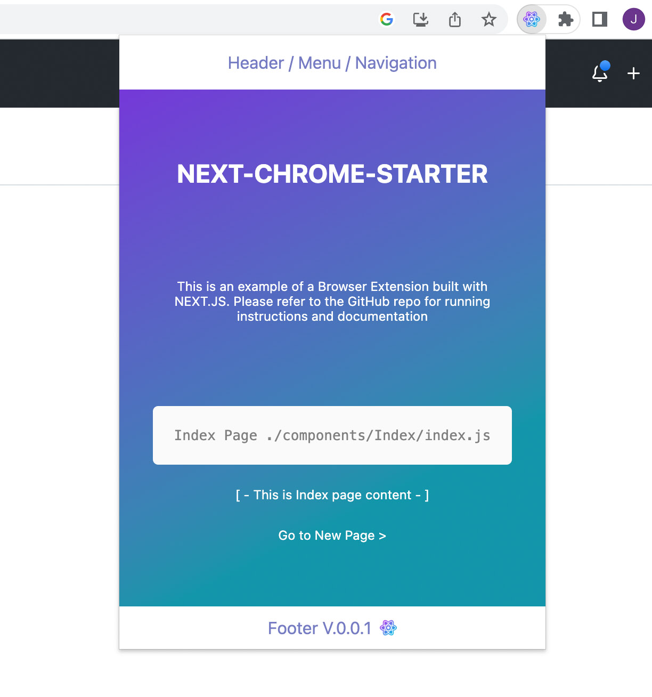
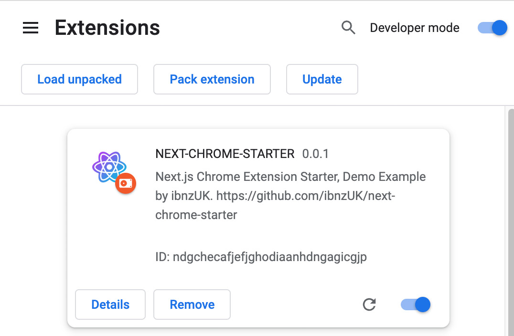

# Simple Notes 🚀  

Simple Notes is a Chrome extension built with Next.js for quick and easy note-taking right from your browser.

## Table of Contents ✨  

- [Description](#description)
- [Installation](#installation)
- [Usage](#usage)
- [Contributing](#contributing)
- [License](#license)

# Description

Simple Notes provides a clean, simple interface for taking notes directly within your Chrome browser. Built with Next.js, React, and modern web technologies.




# Installation

To install and run Simple Notes locally, follow these steps:

1. Clone this repository: 

   ```bash
   git clone https://github.com/sitasp/simple-notes.git
   ```
2. Navigate to project directory: 

   ```
   cd simple-notes
   ```
3. Install the dependencies using npm: 
   ```
   npm install
   ```

# Usage
## Usage Locally  🔥
To run Simple Notes locally, follow these steps:

Run the project:
```
npm run dev
```
`This will run project on your localhost`

 http://localhost:3000/

## Build and Import To Chrome 🔥
To build and import Simple Notes to chrome browser, follow these steps:

1. Build the project:
```
npm run build
```
`This will run prep and export to create new folder 'out/', and rename '_next' forlder to 'next' (without underscore)`

2. Open Google Chrome and go to chrome://extensions.


3. Enable the "Developer mode" toggle switch.

4. Click on "Load unpacked" and select the out folder generated by the build process.

5. Simple Notes should now be loaded as an unpacked extension in Google Chrome.



# Contributing
Contributions to Simple Notes are welcome! If you find any issues or have suggestions for improvements, please feel free to open an issue or submit a pull request.

# License
This project is licensed under the MIT License.
